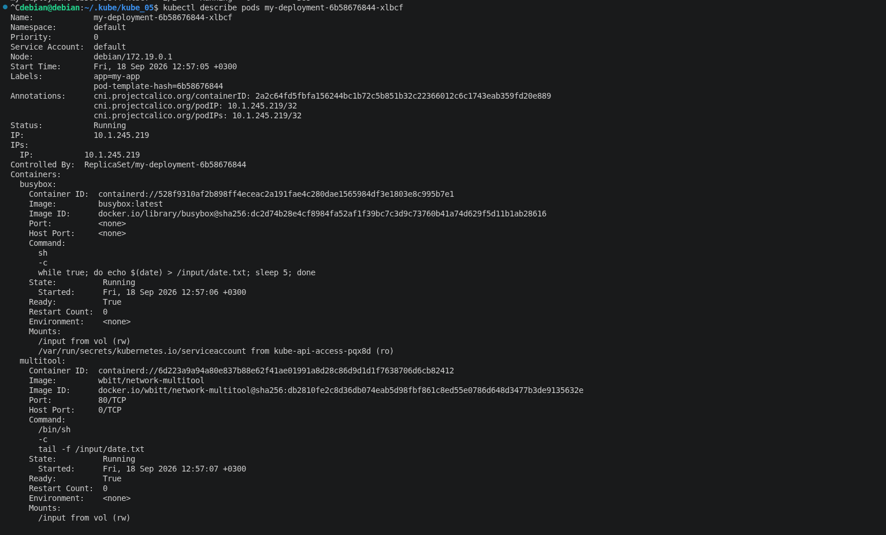
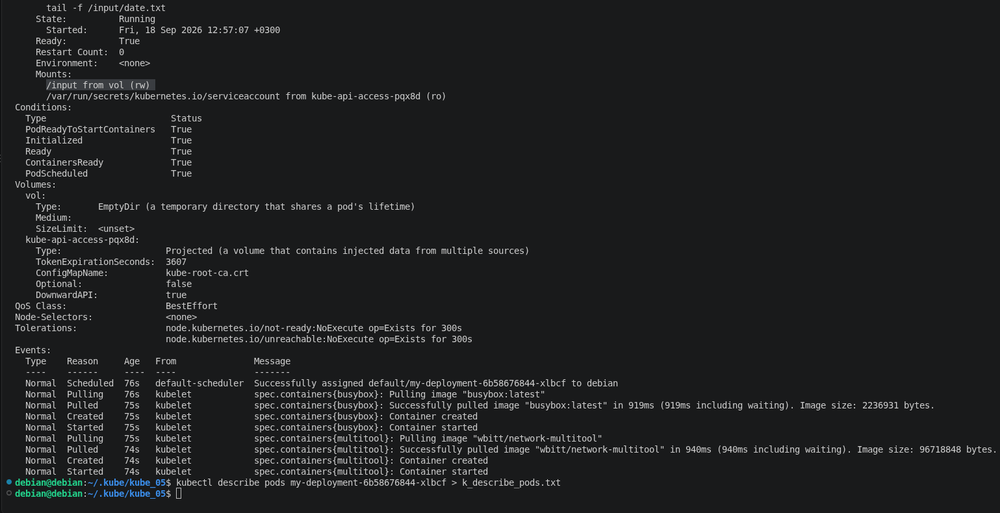
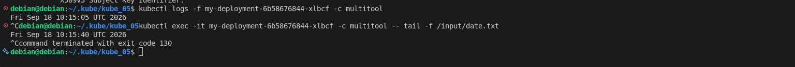
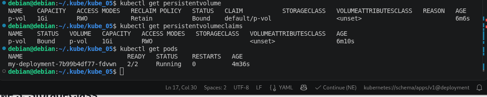
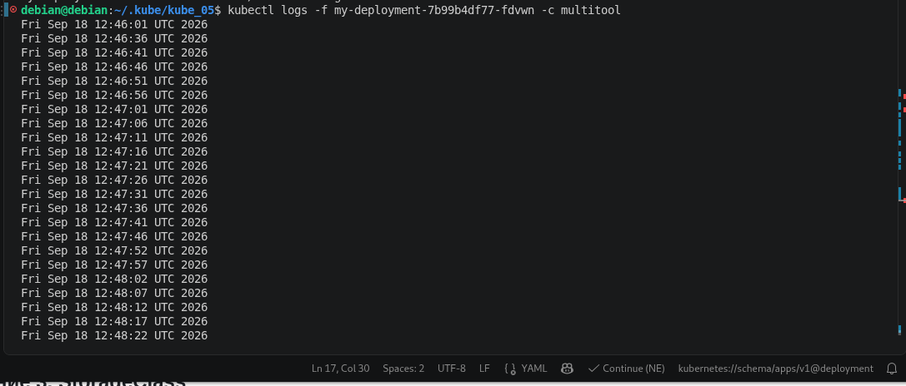
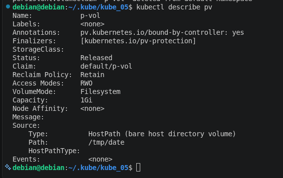
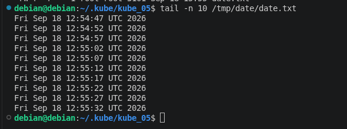
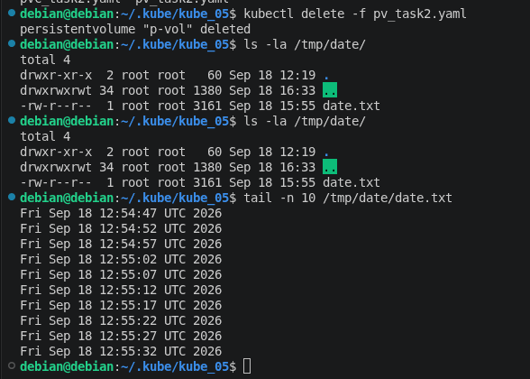
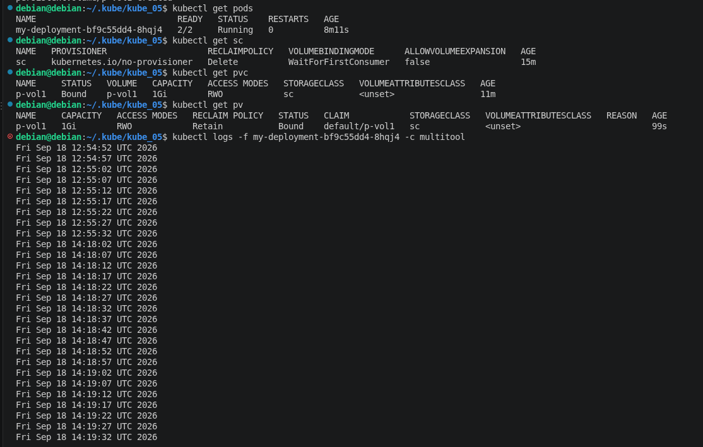

# kube_05

## Задание 1. Volume: обмен данными между контейнерами в поде

### Манифесты

**[deploy_task1.yaml](https://github.com/ufilin/kube_05/blob/main/deploy_task1.yaml)**

Дополнительно прикладываю файл результата вывода "kubectl describe pods" для удобства чтения:

**[kubectl describe pods](https://github.com/ufilin/kube_05/blob/main/k_describe_pods.txt)**

### Описание пода с контейнерами

  

  

### Вывод команды чтения файла

  

## Задание 2. PV, PVC

### Манифесты

**[pv_task1.yaml](https://github.com/ufilin/kube_05/blob/main/pv_task2.yaml)**
**[pvc_task1.yaml](https://github.com/ufilin/kube_05/blob/main/pvc_task2.yaml)**

### PV и PVC

  

### Демонстрация доступности из контейнера multitool

  

### Состояние PV после удаления Deployment and PVC

  

Состояние поменялось на Released в связи с тем что reclaim policy установлено retain. PV не удаляется и не может быть переиспользовано новым PVC.

### Состояние файл "до" и "после" удаления PV

  

  

  

Файл на Node не трогается в связи с выбранной политикой Retain. В случае работы с PV с использованием данной политики файл остаётся не тронутым, правяться только метаданные в etcd.

## Задание 3. StorageClass

### Манифесты

**[sc_task3.yaml](https://github.com/ufilin/kube_05/blob/main/sc_task3.yaml)**

### Демонстрация всех созданных элементов и доступность данных из контейнера multitool

  

